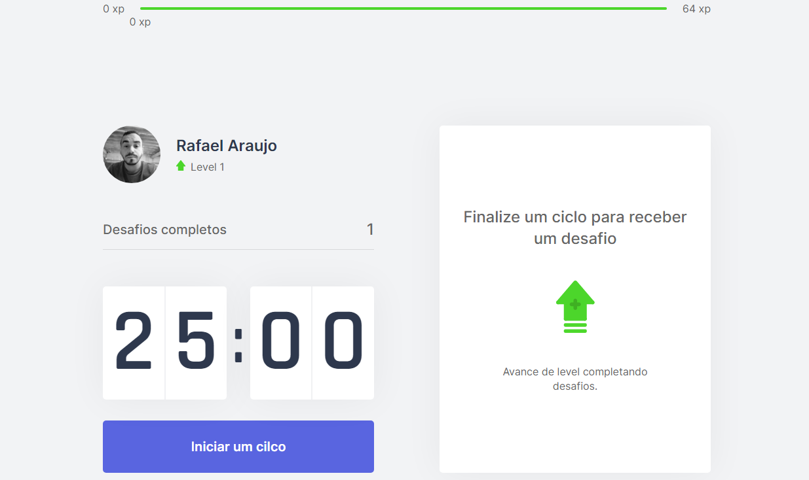

<p align="center">
  
</p>

<h1 align="center">
🚧 MoveIt 2.0 | Em Construção 🚧
</h1>

<p align="center">

  

  

  <a href="https://www.linkedin.com/in/rafaelasilva1993/">
      
  </a>

  <a href="https://github.com/Alquipo/moveit/commits/master">
      
  </a>

  

</p>

<p align="center">

  <a target="_blank" href="https://reactjs.org/">
    
  </a>

  <a target="_blank" href="https://nextjs.org/">
      
  </a>
</p>

<h1 align="center">
  Bem Vindo ao App MoveIt 1.0
</h1>


## 🚀 Sobre o Projeto

MoveIt e uma aplicação para incentivar quem fica horas no computador a se exercitar, usando o método pomodoro, a cada 25 minutos concentrado no trabalho ele terá uma pausa para efetuar um pequeno exercício e com adição da gamificação na aplicação tudo fica mais divertido.

Projeto desenvolvido durante a **NLW#04** oferecida pela [Rocketseat](https://rocketseat.com.br).


## 🎨 Layout

Design feito por [Tiago Luchtenberg](https://www.instagram.com/tiagoluchtenberg/)


<h1 align="center">Move it</h1>

<p align="center">
  
</p>


## Tecnologias utilizadas
* [HTML](https://html.org)
* [CSS](https://css.org)
* [Reactjs](https://pt-br.reactjs.org)
* [Nextjs](https://nextjs.org)
* [Typescript](https://www.typescriptlang.org/)


## 🚀 Como executar o projeto

- Antes de começar, você vai precisar ter instalado em sua máquina as seguintes ferramentas: [Git](https://git-scm.com), [Node.js](https://nodejs.org/en/). 
- Além disto é bom ter um editor para trabalhar com o código como [VSCode](https://code.visualstudio.com/).
- Instale **[Yarn](https://yarnpkg.com/)** para ter uma melhor experiência quando for executar a aplicação.

### 🌀 Faça o clone do projeto

```bash
# Clone este repositório
$ git clone <https://github.com/Raafa1993/moveit>

# Acesse a pasta do projeto no terminal/cmd
$ cd Moveit

```


### 💻 Rodando a aplicação web
```bash

# Instale as dependências
$ yarn install

# Execute a aplicação 
$ yarn dev

# O aplicação inciará (geralmente) na porta:3000 - acesse <http://localhost:3000>
```


## 👨🏻‍🚀 Sobre mim
<a href="https://www.linkedin.com/in/rafaelasilva1993/">
 
 <p>Rafael Araujo da Silva</p>
</a>

## 💜 Agradecimentos
Obrigado [Rocketseat](https://rocketseat.com.br) por disponibilizar esse conteúdo de maneira acessível a todos🚀.